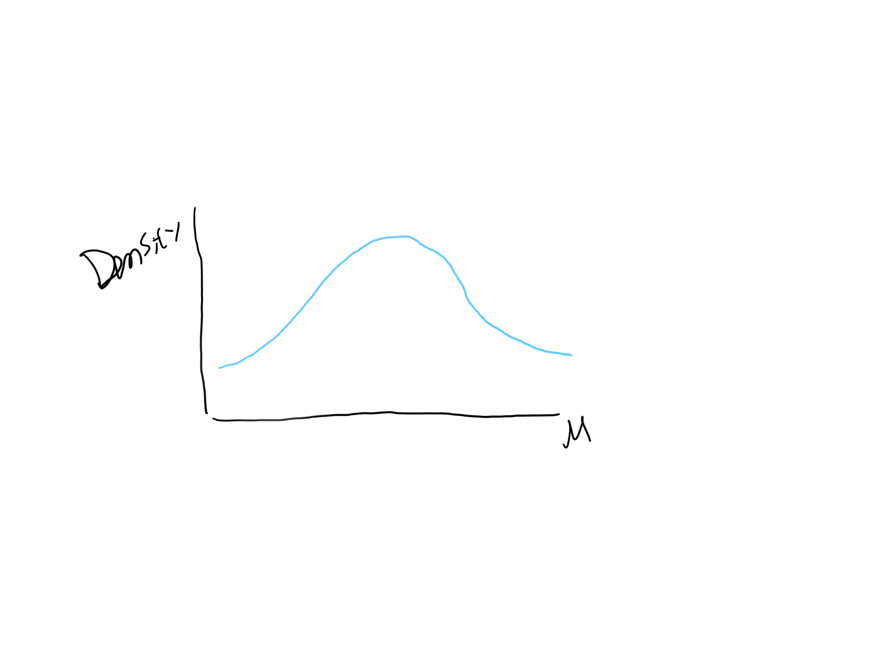
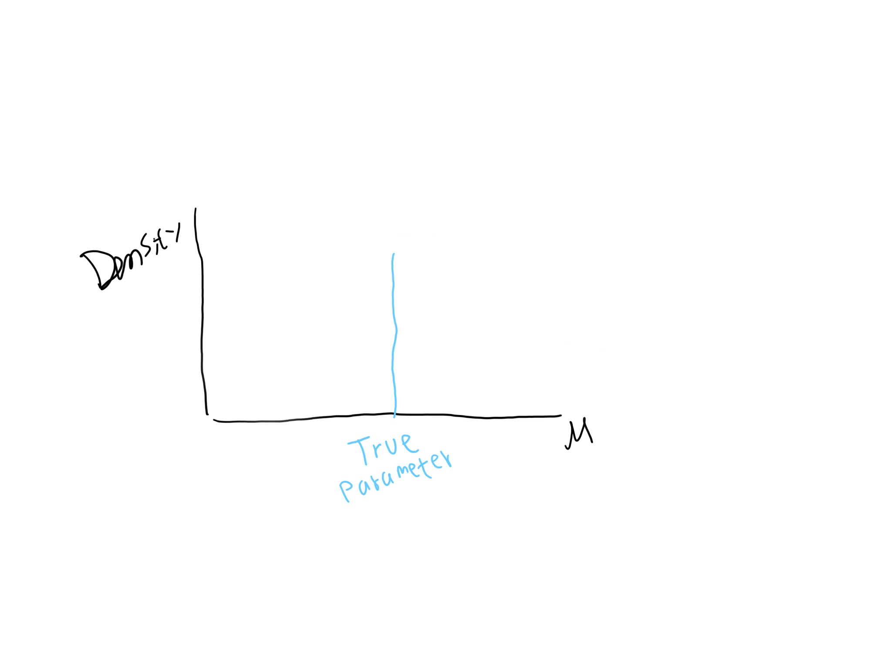

***

# Bayesian and Frequentist Paradigm

**What is the difference between bayesian and frequentist?**

*Posted on January 2023*

***

The general belief of the difference between the bayesian and frequentist paradigm in statistics is that bayesian believe that probability is a reasonable expectation of personal belief while frequentist definition of probability is connected to the number of events in the past. And while bayesian is subjective, frequentist is not. That sounds cool… but what does it actually mean? What are the consequences of using one paradigm over the other in our analysis? In my opinion, this explanation is not very intuitive. This just seems like the difference is only in philosophical terms and people rarely explain the difference in technical terms.

Before we explain bayesian paradigm, we need to have a clear understanding that what we are trying to do in statistics is creating an artificial model so that this model can mimic the true model. We do not know the true model and we will never know the true model, no matter how much data we collected. We collect some data and we get a set of samples. This set of samples has a mean. But wait a second, if we collect another set of data, we will get a different mean than before. So which one is true? The problem gets even worse that we can technically have an infinite amount of estimation of mean.

But do not worry, we can easily assume that all samples come from the same model (which is the true model) and assign a probability distribution to it. This is the heart of bayesian paradigm. We will never know the true parameter (in the case above, the parameter is mean) of the model because variability exists in the world. But bayesian is not going to stop there, so they model this variability of the parameter using probability distribution. Figure below shows what bayesians believe about the nature of a parameter.

But wait a second, isn’t the parameter of the model supposed to be one value as opposed to many values? You know.. because the true model should be one. This is what frequentists say about bayesians distribution of parameters. They do not want to use probability distribution to model the parameter of the model. To frequentist, the parameter is fixed on some value that they do not know. Frequenstist belief about a parameter of model can be seen from figure below.

So what is a frequentist gonna do to reduce the variability in the parameter? They simulate. Whether it is using real experiment, simulation software, or even mental simulation, they simulate the model to produce many sets of samples. After that they can make a statement such as “After repeated number of simulations, 95% of the times the sets of samples will have a mean in the range between X1 and X2. So, I am confident 95% of the times the mean of the model will be between X1 and X2”. Notice that frequentists do not say anything about probability of parameter because they do not want to create a probability distribution of the parameter. Instead they replace it with confidence.

The consequences of this difference in interpretation of ‘probability’ is massive. Bayesians are willing to model the variability of the parameter with their own probability distribution. This is what it meant for subjectivity in bayesian paradigm. Frequentist, while they replace probability with confidence in parameter estimation, appear at least more objective than bayesian because they do not assume any distribution for the parameter. This is what we usually find in articles on the difference between bayesian and frequentist.

Another consequence of this difference is in their method of analysis. In bayesian paradigm we have statistical tools such as likelihood functions to compare to different distributions. While in frequentist we have p-value as a tool to compare different distributions. That is why p-value means the probability of the difference in observation caused by ‘chance’ alone. This p-value doesn't make any sense in bayesian paradigm because they have different beliefs about probability. And so does a bayesian statement “there is 90% probability that the mean is between X1 and X2” will never be meaningful by a frequentist.
